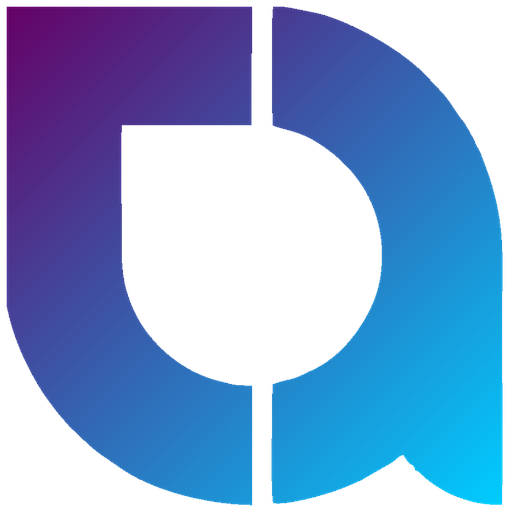
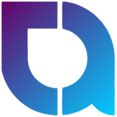
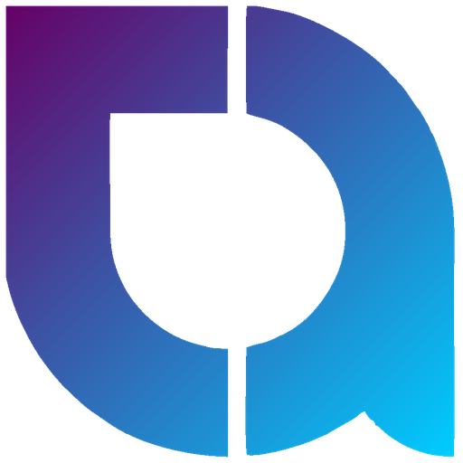
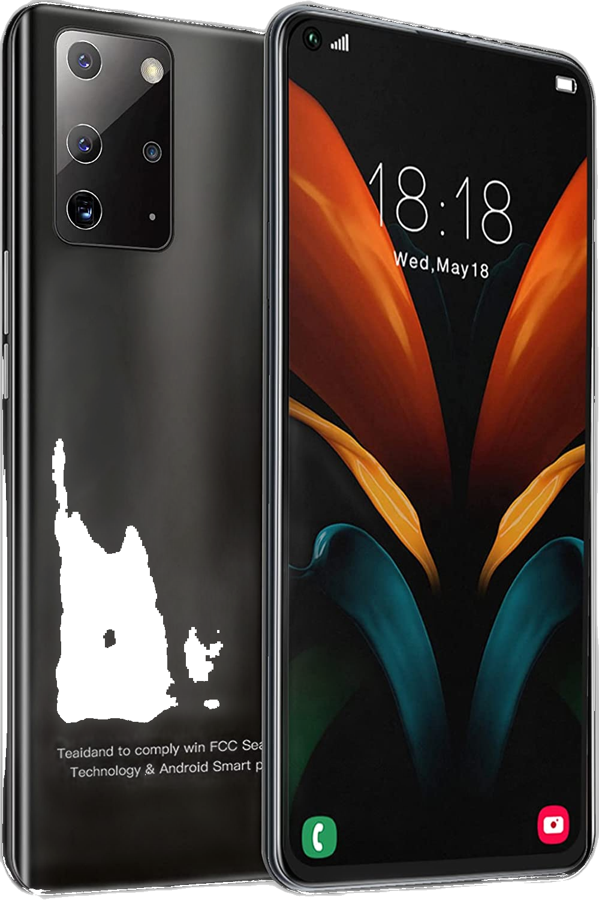
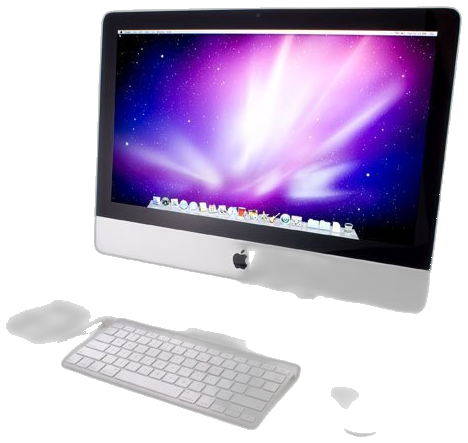
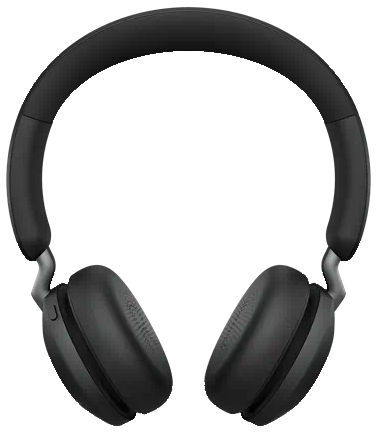
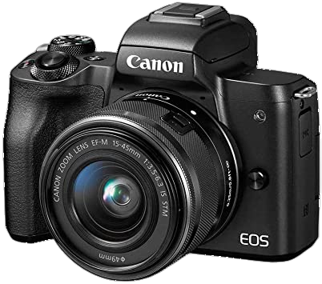
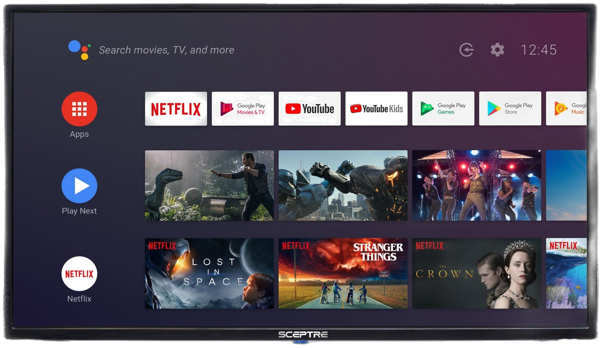
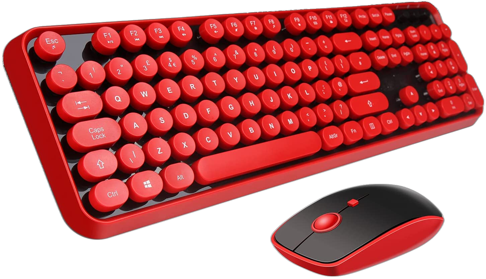
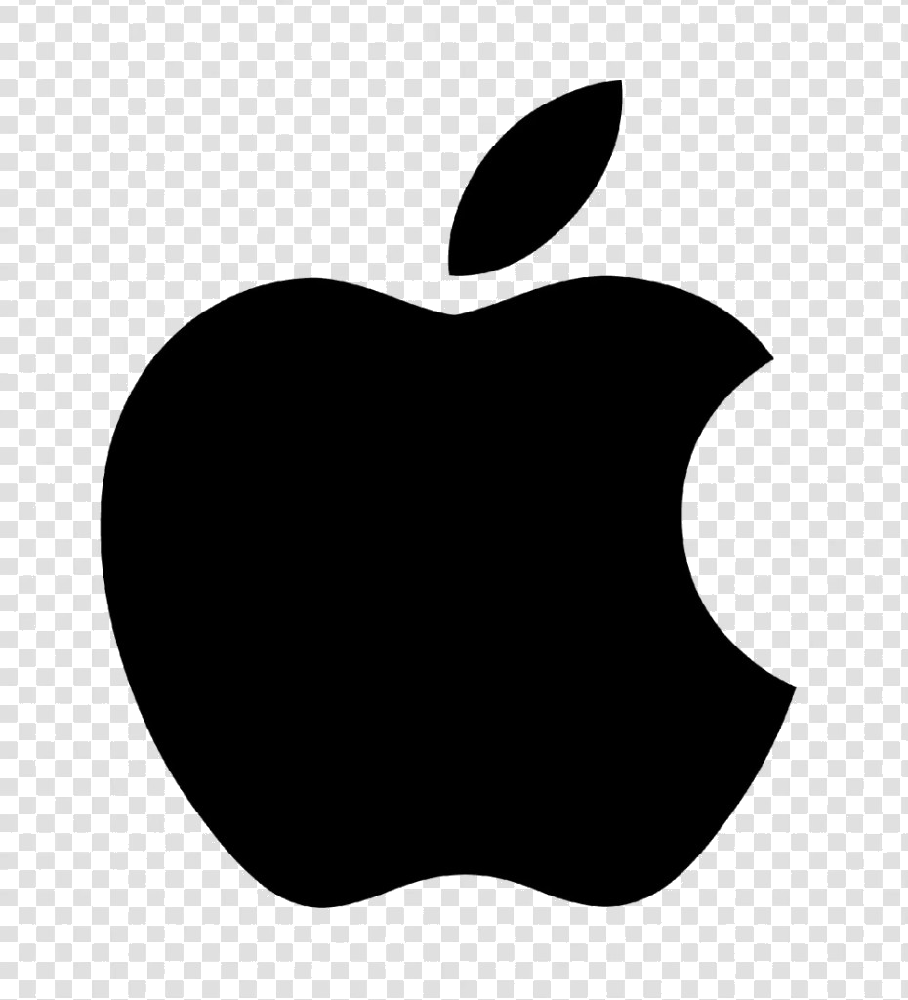

<div align="center">



<br />


<br /><br />

**Phones · Laptops · Accessories — Swap, Buy & Sell**

[](https://nextjs.org/)
[](https://react.dev/)
[](https://www.typescriptlang.org/)
[](./src/app/manifest.ts)
[](#)

<br />

📍 Sel Filling Station, UPSA · Accra, Ghana &nbsp;|&nbsp; 📞 [057 227 3425](tel:+233572273425)

</div>

---

## Overview

**techassure** is a modern e-commerce storefront for phones, laptops, and accessories — built for customers in Accra who want to **swap, buy, and sell** tech with confidence.

This repo powers the full shopping experience: browse, compare, wishlist, cart, checkout, and order tracking — with a progressive web app (PWA) shell for installable, app-like use on mobile.

---

## Brand

<table>
  <tr>
    <td align="center" width="25%">
      <br />
      <sub>App icon (192)</sub>
    </td>
    <td align="center" width="25%">
      <br />
      <sub>App icon (512)</sub>
    </td>
    <td align="center" width="25%">
      <br />
      <sub>Logo mark</sub>
    </td>
    <td align="center" width="25%">
      <br />
      <sub>Full logo</sub>
    </td>
  </tr>
  <tr>
    <td align="center" colspan="2">
      <br />
      <sub>Wordmark (light backgrounds)</sub>
    </td>
    <td align="center" colspan="2">
      <br />
      <sub>Wordmark (dark backgrounds)</sub>
    </td>
  </tr>
</table>

Theme color: `#7b2ff7`

---

## Features

| | Feature | Description |
| :--- | :--- | :--- |
| 🛍️ | **Shop catalog** | Browse phones, laptops, headphones, cameras, TVs & accessories |
| ⚡ | **Best deals & flash sales** | Highlighted promotions, flyers, and featured product grids |
| 🔍 | **Product detail & quick view** | Full product pages plus in-place quick view |
| ❤️ | **Wishlist** | Save products for later |
| ⚖️ | **Compare** | Side-by-side product comparison |
| 🛒 | **Cart & checkout** | Quantity controls, checkout flow, and success confirmation |
| 📦 | **Track order** | Look up order status after purchase |
| 📱 | **PWA** | Installable app with service worker & web app manifest |
| 💳 | **Local payments** | MoMo, card & bank transfer messaging |
| 🏪 | **Visit / call to order** | Storefront at UPSA + phone ordering |

---

## Categories

<div align="center">

| <br />Smartphones | <br />Computers & Laptops | <br />Headphones |
| :---: | :---: | :---: |
| <br />Camera & Photo | <br />TV & Homes | <br />Accessories |

</div>

---

## Brands

<div align="center">


&nbsp;&nbsp;

&nbsp;&nbsp;

&nbsp;&nbsp;

&nbsp;&nbsp;

&nbsp;&nbsp;

&nbsp;&nbsp;

&nbsp;&nbsp;

&nbsp;&nbsp;


</div>

---

## Tech stack

| Layer | Choice |
| :--- | :--- |
| Framework | [Next.js 16](https://nextjs.org/) (App Router) |
| UI | [React 19](https://react.dev/) + CSS Modules |
| Language | [TypeScript 5](https://www.typescriptlang.org/) |
| Icons | [Lucide React](https://lucide.dev/) |
| Font | [Outfit](https://fonts.google.com/specimen/Outfit) via `next/font` |
| PWA | Custom service worker (`public/sw.js`) + `manifest.ts` |

---

## Project structure

```text
cliton/
├── public/
│   ├── icons/                 # PWA & favicon assets
│   │   ├── icon-192.png
│   │   ├── icon-512.png
│   │   ├── icon-512-maskable.png
│   │   └── apple-touch-icon.png
│   ├── images/
│   │   ├── logo*.png / .svg   # Brand logos & wordmarks
│   │   ├── brands/            # Partner brand marks
│   │   ├── categories/        # Category imagery
│   │   ├── products/          # Product photography
│   │   ├── hero/ · flyers/ · shop/
│   └── sw.js                  # Service worker
├── src/
│   ├── app/                   # Routes (home, shop, cart, checkout…)
│   ├── components/
│   │   ├── home/              # Hero, deals, categories, banners
│   │   ├── layout/            # Header, footer, cart popup, gate
│   │   ├── product/           # Detail & quick view
│   │   ├── shop/ · cart/ · checkout/
│   │   ├── compare/ · wishlist/ · track/
│   │   └── pwa/
│   └── data/                  # Products, cart, brands, flyers…
└── package.json
```

---

## Routes

| Path | Page |
| :--- | :--- |
| `/` | Home — hero, flyers, deals, categories, featured products |
| `/shop` | Product catalog with filters |
| `/product/[id]` | Product detail |
| `/cart` | Shopping cart |
| `/checkout` | Checkout |
| `/checkout/success` | Order confirmation |
| `/wishlist` | Saved products |
| `/compare` | Product comparison |
| `/track-order` | Order tracking |

---

## Getting started

### Prerequisites

- **Node.js** 20+ (recommended)
- **npm** (or yarn / pnpm / bun)

### Install

```bash
npm install
```

### Develop

```bash
npm run dev
```

Open [http://localhost:3000](http://localhost:3000).

### Build & run production

```bash
npm run build
npm start
```

### Lint

```bash
npm run lint
```

---

## Scripts

| Command | Description |
| :--- | :--- |
| `npm run dev` | Start Next.js development server |
| `npm run build` | Create production build |
| `npm start` | Serve production build |
| `npm run lint` | Run ESLint |

---

## Contact

<div align="center">


**techassure**

📞 **Call / WhatsApp:** [057 227 3425](tel:+233572273425)  
📍 **Visit:** Sel Filling Station, UPSA — Accra, Ghana  
🛍️ Phones, laptops & accessories — we swap, buy & sell

</div>

---

## Deploy

Deploy on [Vercel](https://vercel.com/new) (or any Node host that supports Next.js):

```bash
npm run build
```

Point the hosting platform at this repository and use the default Next.js build settings.

---

<div align="center">


<br />

**techassure** © 2026 · Built with Next.js

<sub>Phones, laptops & accessories — swap, buy & sell at UPSA.</sub>

</div>
